# Orrasis Dark Theme
A dark theme with fun colours for Panic's Nova code editor made with love :)

## Install

1. Go to Preferences in Nova
2. Go to the Theme tab
3. Click the "More Themes" button
4. Search for "Orrasis Dark"
5. Click the Install Button

## Screenshots for various code samples

### HTML
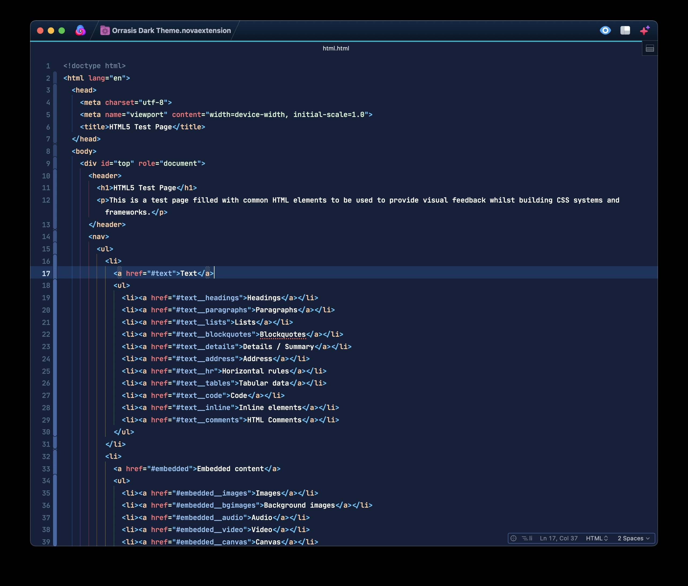

### CSS
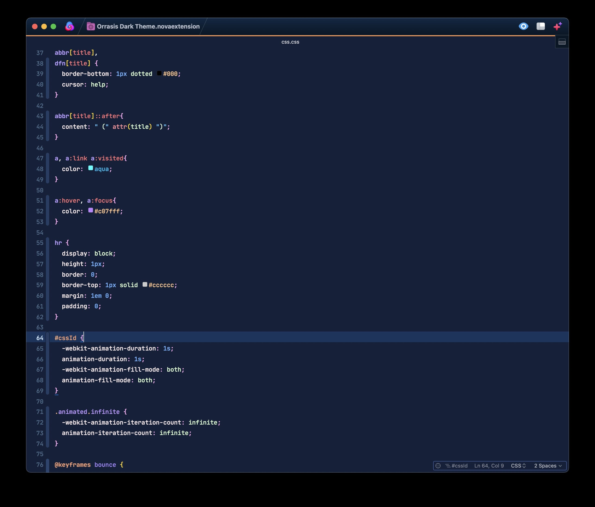

### SASS
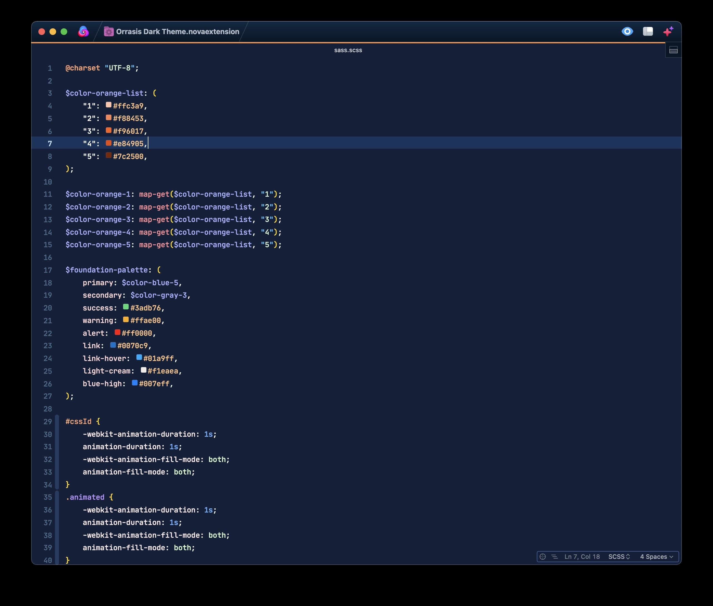

### js
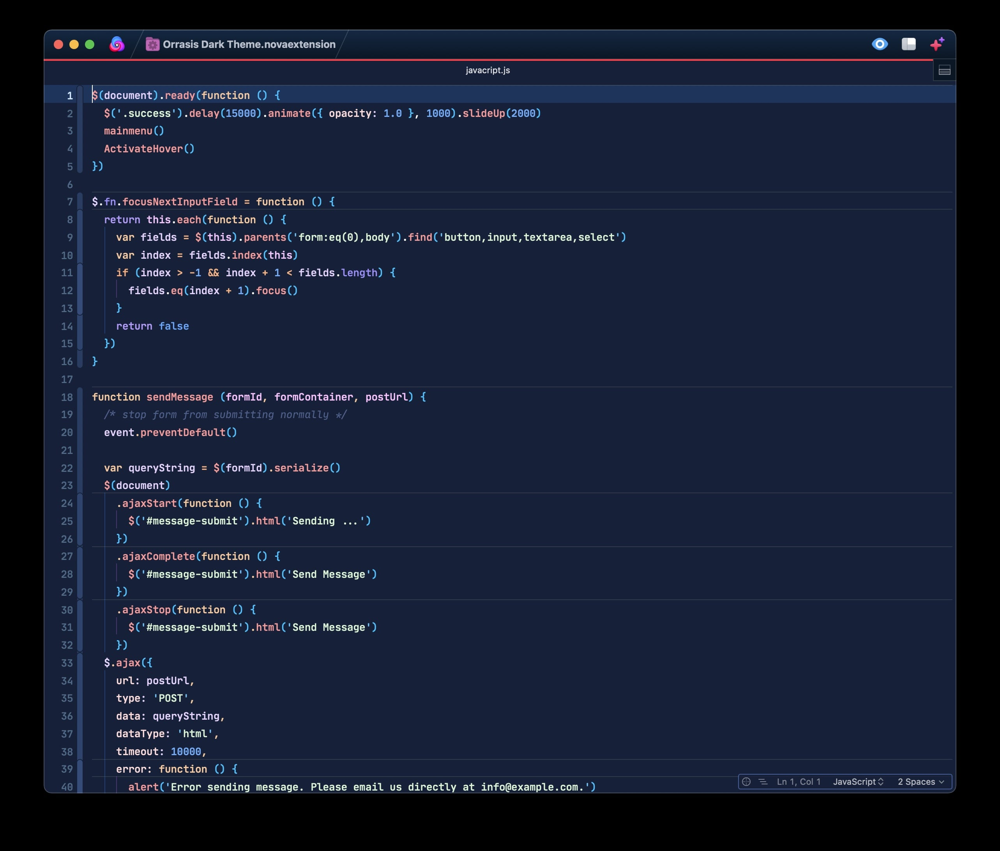

### PHP
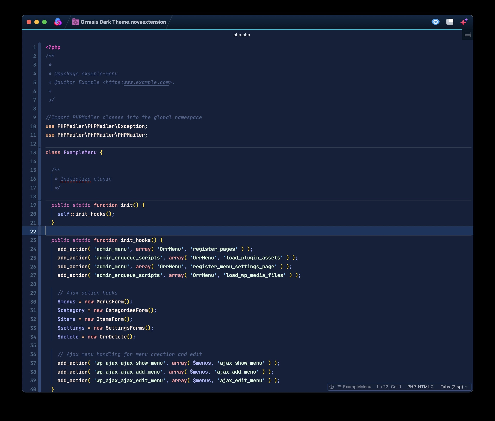

### HTML-PHP
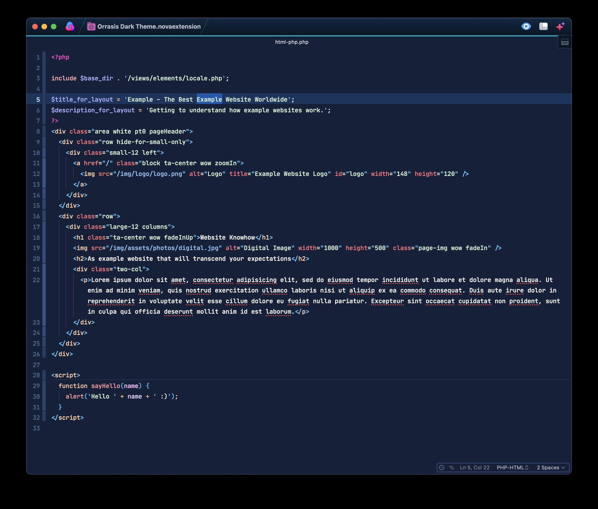

### json
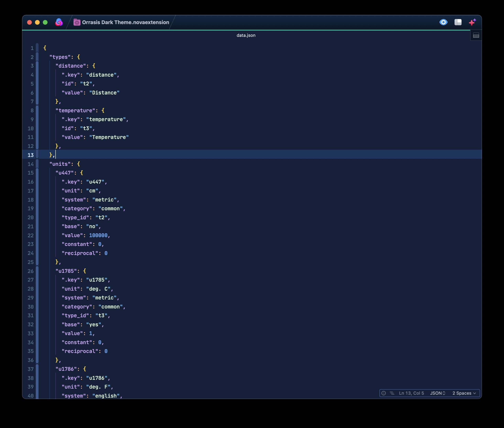

### Markdown
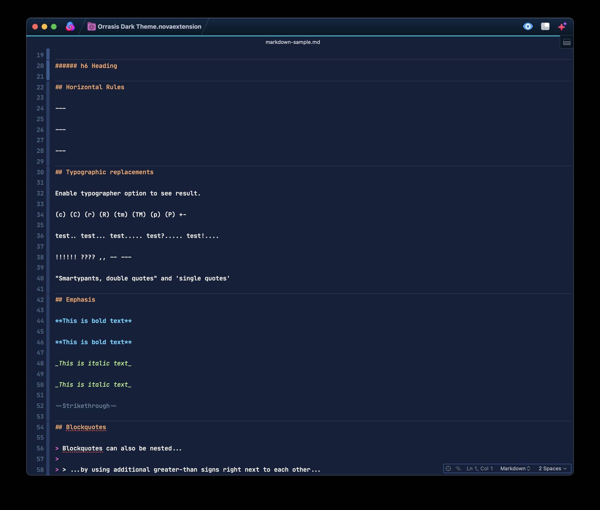

### Vue
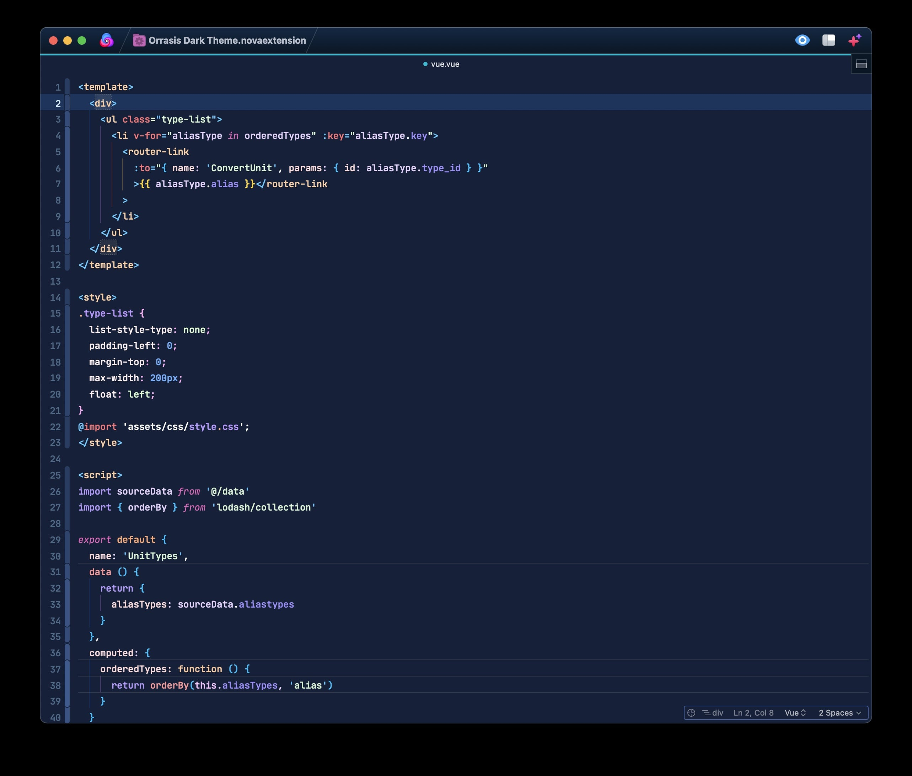

### Typescript
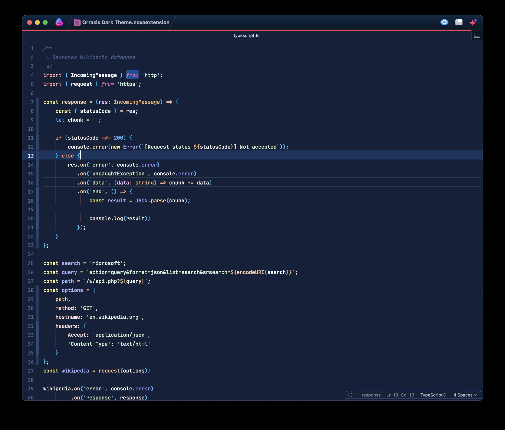

### React
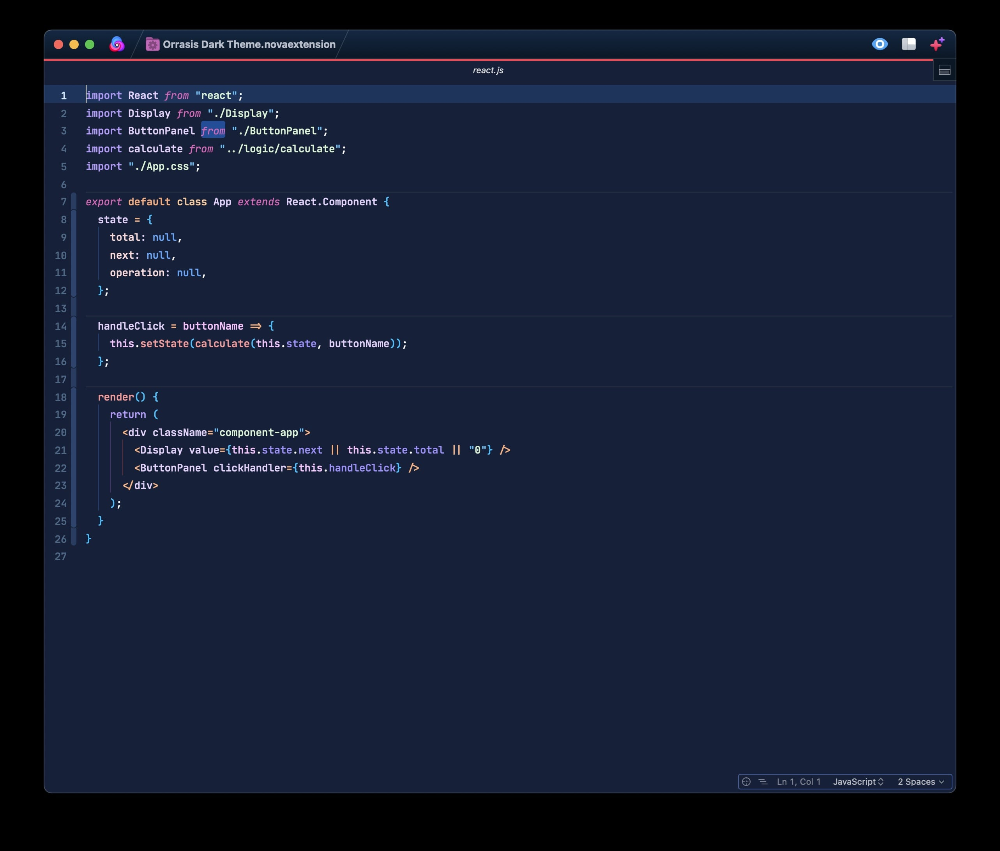

### Python
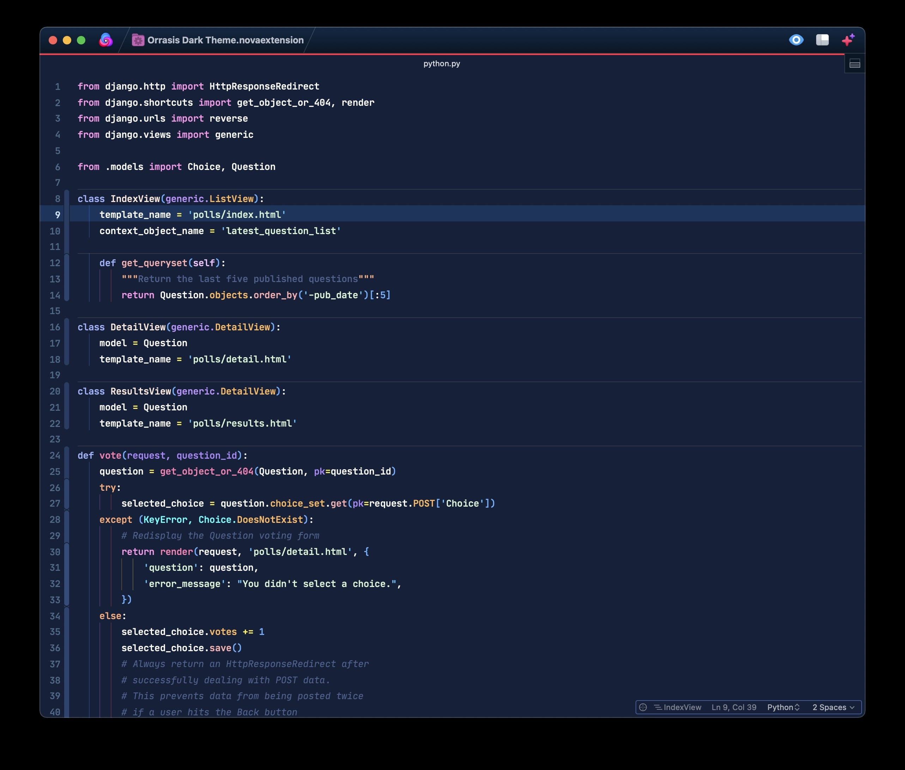

## Contact

If you have any bugs to report or requests, please email me at info@orrasis.com.
